---
format:
  html:
    toc: true
    toc-location: left
    toc-title: "In this session:"
---

# Tutorial 7: Using git and GitHub for version control {#sec-tute07}

In today's tutorial, we will learn how to use git and GitHub to perform version control for analyses in RStudio.

::: {.callout-tip title="Learning Objectives"}
At the end of this session, learners should be able to:

1.  Create a repository on GitHub and link this to an R project

2.  Add and commit changes to files locally, using RStudio's git interface

3.  Push changes from local to remote, using RStudio's git interface

4.  Create new branches and add/commit/push to these

5.  Share a repository with classmates and collaborate on analysis
:::

## Setup

Setting up git and GitHub can take a little time at first, but once it's done, working with them is fairly easy. If you have any trouble with the setup in this section, please let a tutor know.

### Installing git

Before we can start using version control, we first need to make sure git is installed on your computer.

::: {.callout-note title="Terminal vs Console"}
Some of the commands we'll need to run today belong in the **terminal**, as opposed to the **R console**. You can find the terminal in the tab next to the console:

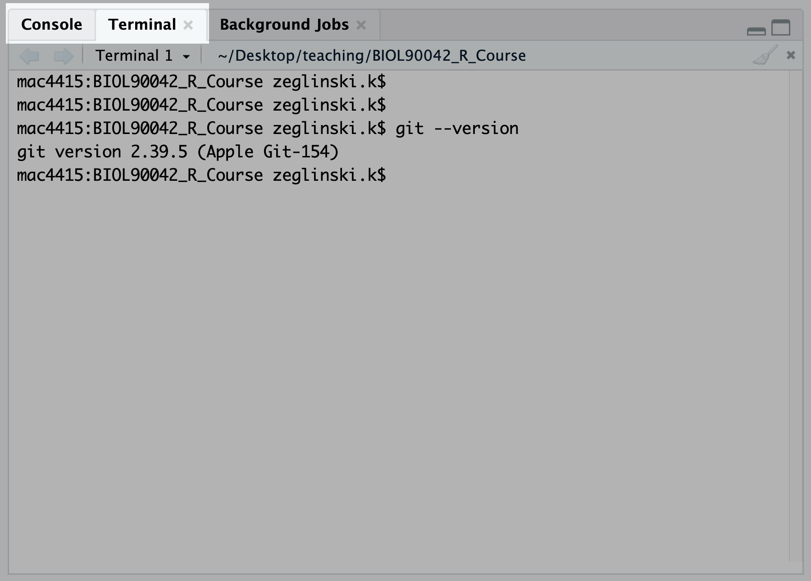{width="800"}

The difference between them is that the **R console** is for **R code** and output, while the **terminal** is a command-line interface to your computer, beyond just R. Using the terminal, you can run software, copy/create/delete files and folders, etc. just like you can using your operating system's graphical interface. Because git is a program separate to R, we need to **run git commands through the terminal**.
:::

To check whether you already have git installed, open up the **Terminal** tab in RStudio (next to the Console tab) and type:

```{bash}
#| eval: false
git --version
```

If git is installed, you'll see something like `git version 2.39.2` printed out.

If you get an error, git is not installed. Install it from [the git website](https://git-scm.com/), restart RStudio, and try running `git --version` again to confirm that the installation worked.

::: {.callout-note title="Telling git who you are"}
Git likes to know who is making changes, so it can keep track of who did what in a project's history. The first time you use git, you should tell it your name and email address by running these lines in the **terminal** (not the Console!):

```{bash}
#| eval: false
git config --global user.name "Your Name"
git config --global user.email "your.email@example.com"
```

You only need to do this once per computer.
:::

### Creating a GitHub account and PAT

Git manages version control on our own computer (known as **local**), but to share our work and collaborate with others we need a place to store our repositories online (known as **remote**). This is where **GitHub** comes in: it's a website that hosts git repositories, and is the most widely used platform for this in both industry and academia. There are other options like gitlab or bitbucket, but, GitHub is by far the most popular.

If you don't already have one, head to [github.com](https://github.com) and sign up for a free account. Try to choose a professional username, as this is something future collaborators or employers will see!

::: {.callout-tip title="GitHub Education"}
While you're at it, consider registering for [GitHub Education](https://github.com/education) using your student email. This gives you free access to extra features, like GitHub Copilot (AI tool for coding).
:::

Once you have an account, we need one more thing before RStudio and GitHub can talk to each other: a **Personal Access Token (PAT)**. The PAT is like a password that's specifically for letting other programs (like RStudio) act on your behalf on GitHub.

To create a PAT, follow [this link](https://github.com/settings/tokens/new?scopes=repo,user,gist,workflow) and give your token a name and expiration date:

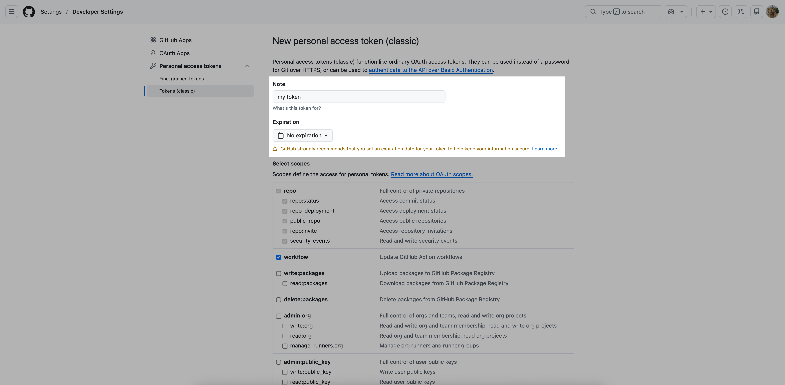{width="1994"}

What you're supposed to do is have multiple PAT for each task you do, each with its own expiry date (e.g. one for this subject, that expires at the end of the semester). Personally, I just have one PAT that has no expiration that I use for everything. **This is not good practice**, but I don't put anything on GitHub that I'm not comfortable with being public (e.g. commercially-sensitive research data) and I'm certainly not important enough for someone to want to hack into my GitHub and do anything nefarious. Do what you're comfortable with.

Once you've set those, scroll down and click **Generate token**.

::: {.callout-warning title="Copy your token somewhere safe!"}
GitHub will only show you the token **once** on the next screen:

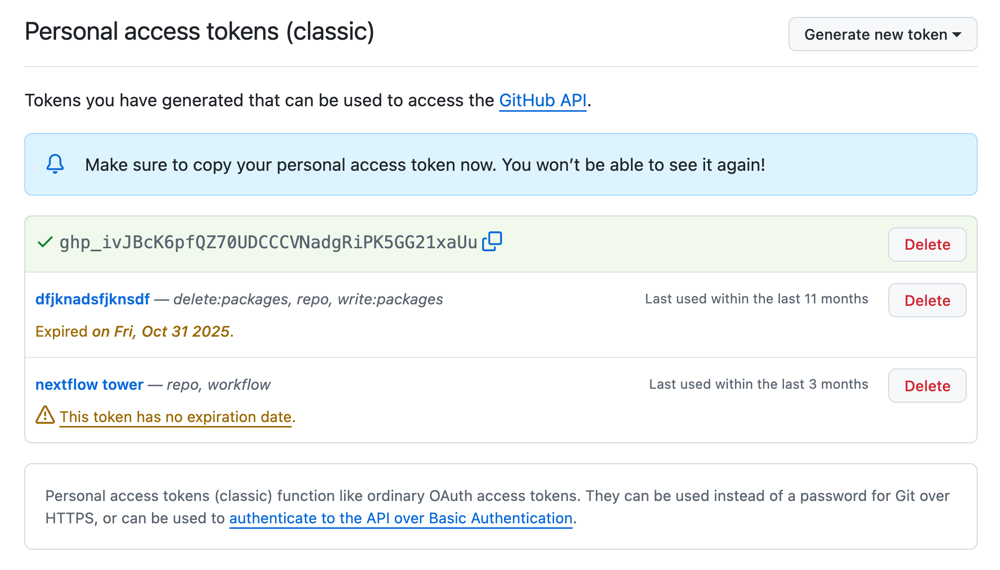{width="1014"}

Copy it immediately, as you won't be able to view it again (although you can always generate a new one if you lose it).
:::

Once you have your token copied, go back to RStudio and run:

```{r}
#| eval: false
# first install gitcreds package
install.packages("gitcreds")
gitcreds::gitcreds_set()

# note about the ::
# package_name::function() is an alternative way to access
# functions from packages, without needing to use library(package_name)
```

You'll be prompted to paste in your PAT, and you shouldn't need to do this again as RStudio will remember it.

## Creating your first 'repo'

Fun fact: most people just call repositories 'repos' for short.

### Using GitHub to make a repository

Now that git and GitHub are set up, let's create somewhere for our analysis to live! Head to [github.com/new](https://github.com/new) (make sure you're logged in) and you should see a page like this:

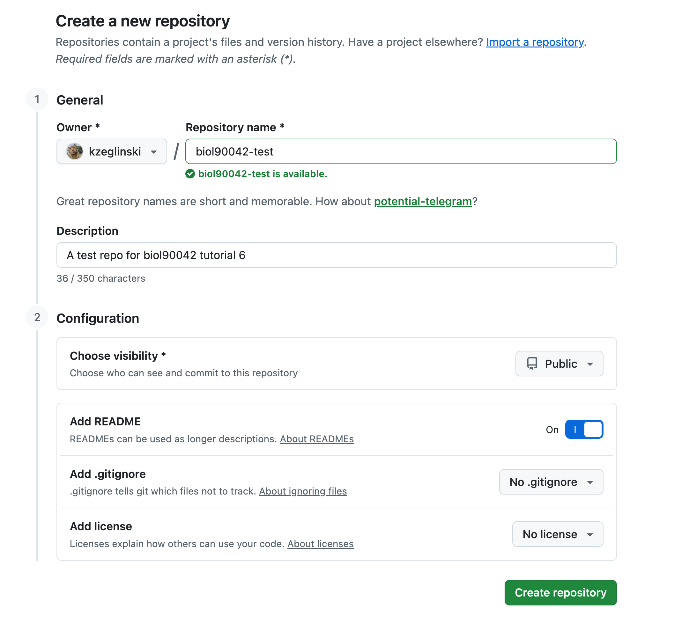{width="1160"}

You'll need to fill in a few details, as shown above:

-   **Repository name**: choose something short and descriptive, without spaces (this is similar to how we name our variables, see @sec-variables). For this exercise, you might like to call yours something like `mousezempic-analysis` or `biol90042-test`. The name needs to be unique to your GitHub account, but it's ok for two different people to have the same repository name.

-   **Public or private**: public repositories can be seen by anyone, while private ones are only visible to you and people you invite. I usually make my repositories public, unless I'm still working on them/they're really messy. Public repositories are a great way to share your analysis code with the wider scientific community (e.g. for your thesis or a publication) and if you are interested in pursuing bioinformatics further, potential supervisors or employers often like to look through your GitHub.

-   **Add a README file**: tick this box. A README is a file (usually written in a format called Markdown, which is a little bit like quarto) that describes what your repository is about, and it's good practice to always include one

Once you're happy, click **Create repository**.

### Linking your repository to a new R project

We now have an empty repository sitting on GitHub (remote), but we need to bring a copy down onto our own computer (local) so we can actually work on it. This process is called 'cloning'.

Conveniently, RStudio lets us create a brand new R project directly from a GitHub repository, so we don't need to use terminal commands:

1.  On your repository's GitHub page, click the green '**Code'** button and copy the URL under the HTTPS tab:

    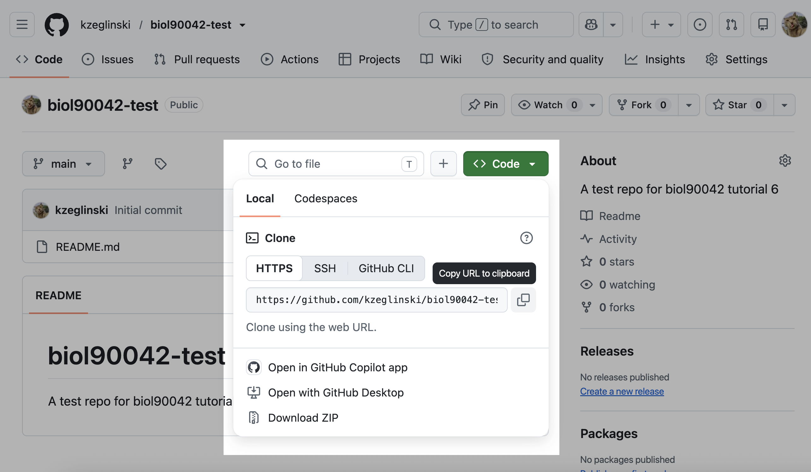{width="1572"}

2.  In RStudio, go to '**File' \> 'New Project' \> 'Version Control' \> 'Git'**

    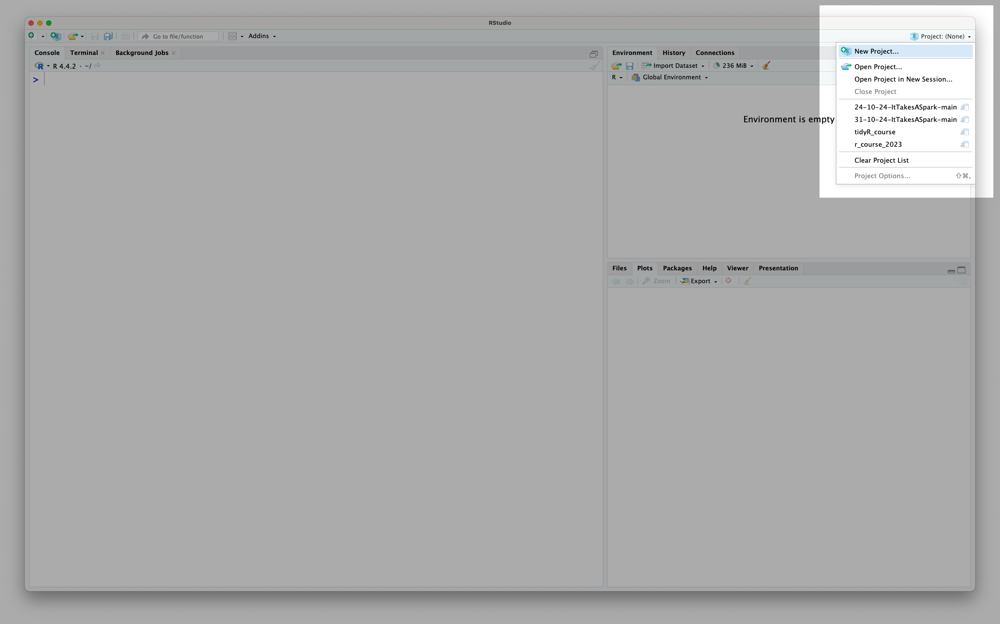{width="1255"}

    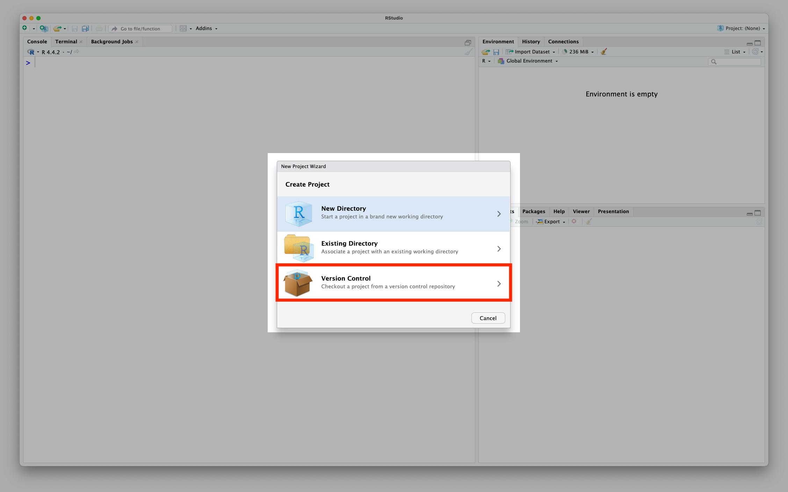{width="1255"}

    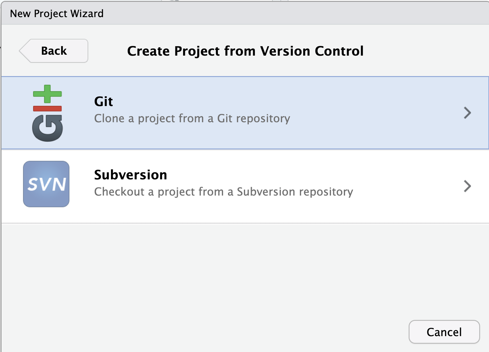{width="800"}

3.  Paste the URL into the '**Repository URL'** field, give the directory a name and choose where you want to put it on your computer. Then click '**Create Project**'

    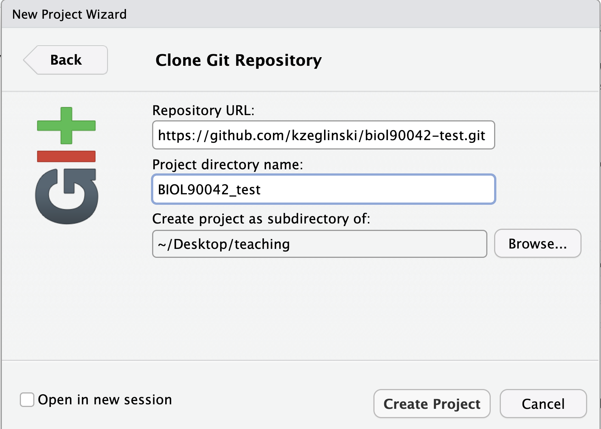{width="808"}

RStudio will open a new session with your project, and you should notice a new tab called **'Git'** has appeared alongside the Environment and History tabs:

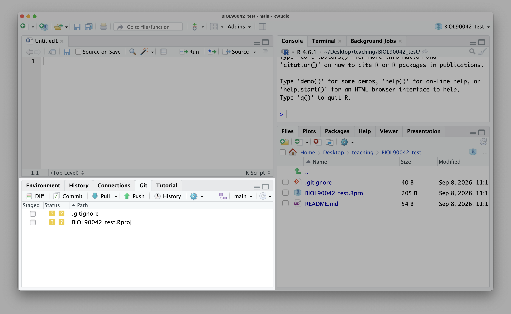{width="1248"}

This is our git interface, and we'll be using it a lot for the rest of this tutorial!

## Let's do some analysis!

Now that our repository is set up, let's actually write some code to track! Create a new R script and save it inside your project.

We'll revisit the mousezempic dosage data that we've been using in this course, and try to answer the following question: does the amount of weight lost by mice increase as the dosage of mousezempic increases, and is this relationship affected by mouse strain or sex?

First, let's load the tidyverse package and read in the data (since we aren't in the usual R project we use in the workshops, let's just read it in from the internet, with the URL)

```{r}
library(tidyverse)
# you can read in files from the internet by providing the URL to them instead of a file path on your computer
dosage <- read_csv("https://raw.githubusercontent.com/WEHI-Education/BIOL90042_R_Course/refs/heads/main/data/mousezempic_dosage_data.csv")
```

To answer this question, let's start by making a scatterplot:

```{r}
dosage %>%
  # first convert drug_dose_g into mg
  # to make it easier to read
  mutate(dose_mg = drug_dose_g * 10000) %>%
  # now make a scatterplot
  ggplot(aes(x = dose_mg, y = weight_lost_g, colour = mouse_strain)) +
    geom_point() +
    # nicer colour palette
    scale_colour_manual(values = c("#ab2929", "#73b7bd", "#ccd65c")) +
    # theme and labels
    theme_classic() +
    labs(
      x = "Drug dosage (mg)",
      y = "Weight lost (mg)",
      colour = "Mouse strain",
      title = "Relationship between drug dosage and weight lost"
      )

```

We've written some code and made a nice plot, but right now, this only exists on your own computer. If your laptop died tomorrow, this important analysis would be lost! Backing up your scripts to GitHub is a handy way to protect against this, along with the benefits of being able to share them with others.

## Adding and committing your changes

### Add files

Look at the **Git** tab in RStudio. You should see your R script there, with a yellow question mark icon next to it. This means the file is 'untracked': git has noticed it exists, but isn't yet keeping an eye on its changes.

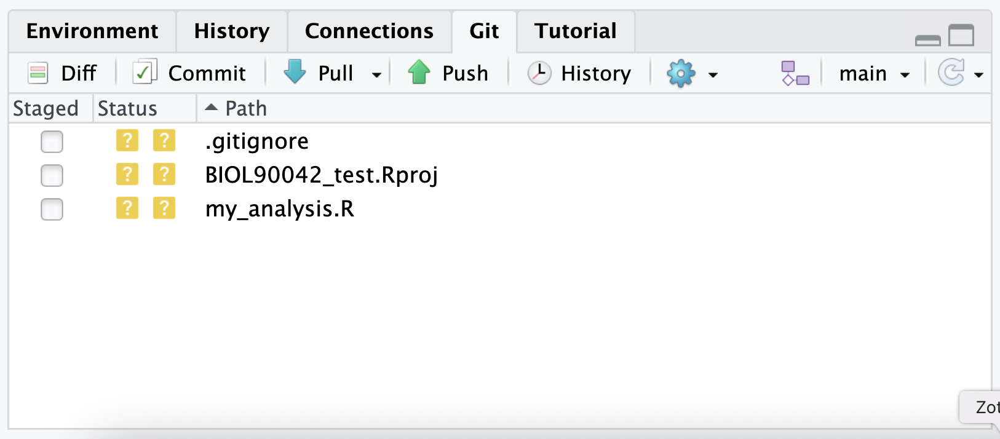{width="826"}

To tell git we want to keep track of these files, we need to 'add' (also known as 'stage') them. You can do this by ticking the checkbox next to your file's name in the Git tab, and the icon should change to a green 'A' (for 'added'):

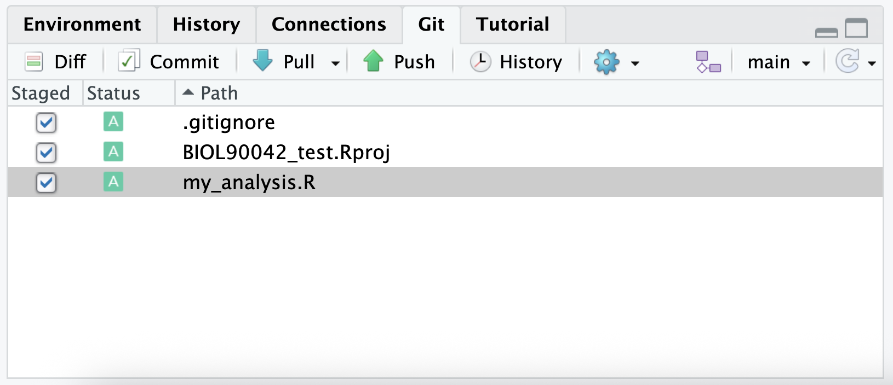{width="830"}

::: {.callout-note title="Why do we need to 'add' files?"}
You might wonder why git makes us tick a checkbox instead of just tracking every file automatically. This process lets you choose exactly which changes should be bundled together into a single commit. For example, if you made changes to two totally unrelated files, you might want to save them as two separate commits with two different messages, rather than lumping them together. This gives you much finer control over your project's history.
:::

### Commit changes

Once your file is staged, click the 'Commit' button. A new window will pop up showing you the changes that are about to be committed. This is called a 'diff', and lines you've added will be shown in green, while lines you've deleted will be shown in red.

In the box in the top right, write a short, descriptive 'commit message' that explains what exactly you've changed. For example: 'Added scatterplot of dosage vs weight loss'.

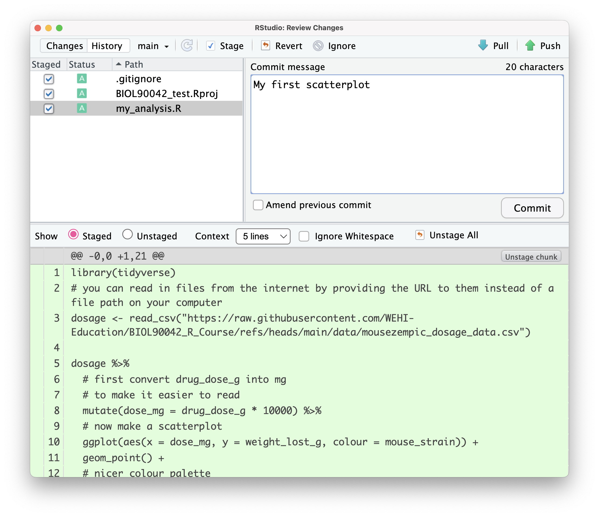{width="1224"}

::: {.callout-warning title="Write good commit messages!"}
It can be tempting to write vague/lazy commit messages like "updates" or "fixed errors", but future you (or your collaborators) will thank you for being descriptive! A good commit message briefly explains (in a sentence) *what* changed and, if it's not obvious, *why*.
:::

Once you've written your message, click 'commit'. You've now made your first commit! You can see a record of all your commits by clicking the 'history' button (the clock icon) in the Git tab.

## Pushing changes to the remote

So far, our commit only exists on our own computer (the local repository). To back it up and share it, we need to send our commits to GitHub (the remote repository). This is called 'pushing'.

In the Git tab, simply click the 'push' button (green up arrow):

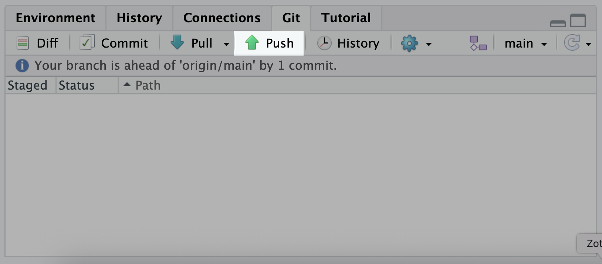{width="828"}

Head back to your repository's page on GitHub and refresh it: you should see your R script sitting there, along with your commit message:

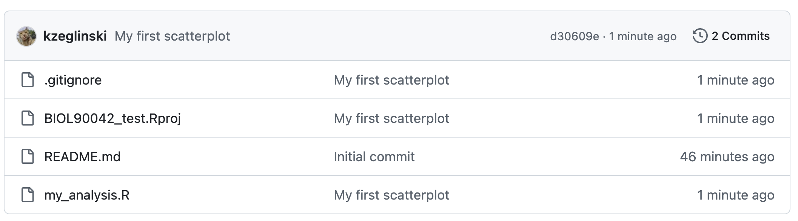{width="1114"}

::: {.callout-important title="Practice exercise: make another commit"}
Try making a small change to your R script (for example, add a comment, or change the colours in `scale_colour_manual()`). Then, add, commit and push this change, following the same steps as above. Remember to save your R script before adding, otherwise your change won't be tracked!

Afterwards, look at the 'history' button in the Git tab, and the commit history on GitHub. Can you see both of your commits listed?
:::

Congratulations, you have now completed the basic git workflow in RStudio!

::: {.callout-note title="Going from an R project to a GitHub repo"}
Sometimes you'll already have an R project on your computer that you want to turn into a git repository and put onto GitHub (i.e. the reverse of starting from a new one on GitHub, like we just did). The easiest way to achieve this is using the `usethis` package:

With your existing project open in RStudio, run:

```{r}
#| eval: false
# install usethis first
install.packages("usethis")
usethis::use_git()
```

This initialises (sets up) git for your project. Then, add your files and commit, as you have learned above.

Once you're ready, run:

```{r}
#| eval: false
usethis::use_github()
```

This will create a brand new repository on your GitHub account and link it to your local project, all in one step!
:::

## Branches

So far, we've been working directly on our project's `main` branch, which is where you always start by default. But what if we want to try out a new idea, without risking breaking the version of our analysis that's already working? This is where branches come in: they let us create a separate, parallel version of our project to experiment in, which we can later bring back together with our main work (or discard, if things don't work out). They're also handy for working with others, but we'll cover that later.

### Let's take a different approach to the analysis!

So far, we've been considering the weight loss of mice in absolute amounts (i.e. the total number of grams that they lost), but the mice had a range of different initial weights. In this section, we'll instead represent weight loss as a **percentage of each mouse's initial body weight**, and repeat our analysis to see if anything changes.

First, we'll create a new branch. In the git tab, click the branch icon (purple, 'L' shaped) in the top right corner.

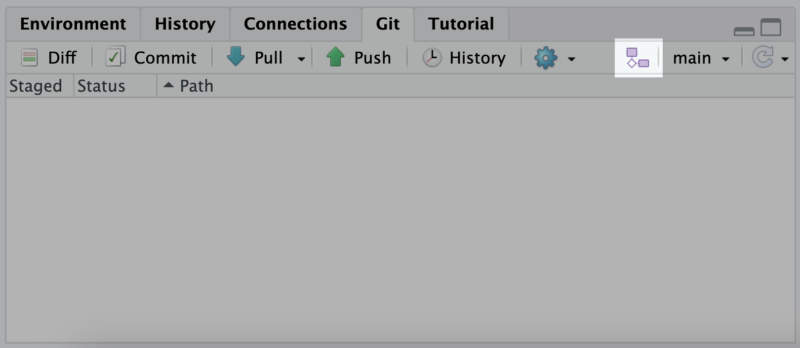{width="820"}

Give your new branch a short, descriptive name, like `percentage-approach`, and make sure 'Sync branch with remote' is ticked, then click 'create'.

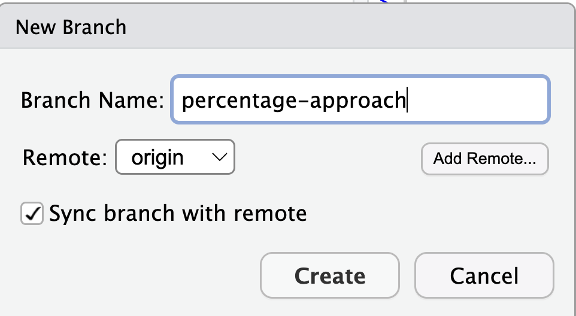{width="462"}

RStudio will automatically switch you onto this new branch, but you can always check which branch you're currently on in the Git tab, the branch name is next to the branch button.

Now, let's perform our alternative analysis. We can create a percentage weight loss column using mutate, and I'll also facet the plot by sex this time too:

```{r}
dosage %>%
  # first convert drug_dose_g into mg
  # to make it easier to read
  mutate(dose_mg = drug_dose_g * 10000) %>%
  mutate(percent_wl = (weight_lost_g / initial_weight_g) * 100) %>%
  # now make a scatterplot
  ggplot(aes(x = dose_mg, y = percent_wl, colour = mouse_strain)) +
  geom_point() +
  # nicer colour palette
  scale_colour_manual(values = c("#ab2929", "#73b7bd", "#ccd65c")) +
  # theme and labels
  theme_classic() +
  labs(
    x = "Drug dosage (mg)",
    y = "Weight lost (mg)",
    colour = "Mouse strain",
    title = "Relationship between drug dosage and weight lost"
  ) +
  facet_wrap(~sex)
```

Just like before, add and commit this change, then push to send your new branch to the remote repo on GitHub.

### Merging your branch back

Now we have two versions of our analysis: our original scatterplot on the `main` branch, and our updated percentage weight loss version on the `percent-approach` branch. Let's say we decide we like this new approach, and want to make it the main version of our analysis (i.e. put it on the main branch) this is called 'merging'.

An easy and well-organised way to do this is through GitHub, using what's called a 'Pull Request' (abbreviated to PR). A pull request is essentially a proposal to merge the changes from one branch into another, and it gives you (or your collaborators) a chance to review changes before they become a permanent part of the project.

On your repository's GitHub page, you should see a prompt asking if you'd like to create a pull request for your recently pushed branch:

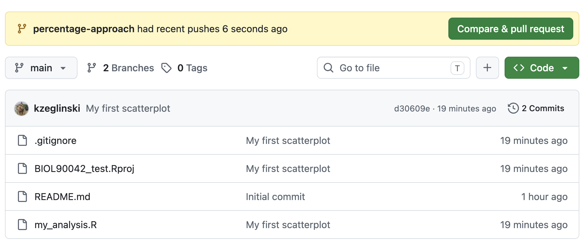{width="1130"}

Click 'Compare & pull request', add a short description of your changes, and click 'Create pull request':

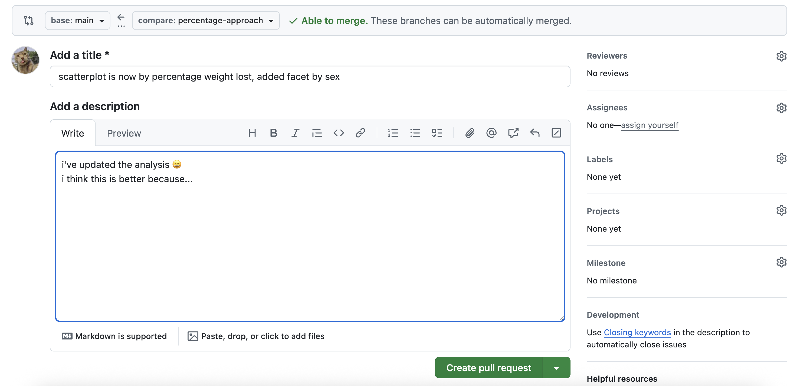{width="1956"}

On the following page, you can review the PR one more time, then click 'Merge pull request' to bring your changes into the `main` branch:

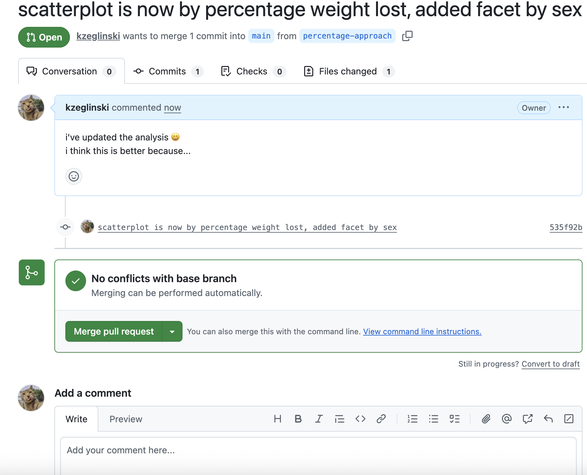{width="914"}

::: {.callout-note title="Merge conflicts"}
Sometimes, if two branches have both changed the same lines of the same file, git won't know which version to keep, and you'll get a 'merge conflict'. Don't panic if this happens! Git will mark the conflicting sections directly in your file, and you just need to manually edit it to decide which changes (or a combination of both) you want to keep, then stage and commit the result. The conflicted sections are marked with conflict markers (`<<<<<<<`, `=======`, and `>>>>>>>`).
:::

Once merged, don't forget to switch back to the `main` branch in RStudio (using the dropdown in the Git tab) and click 'Pull' (blue downwards-pointing arrow). If you read the popup, you'll notice that this brings the recently-merged changes down onto your computer:

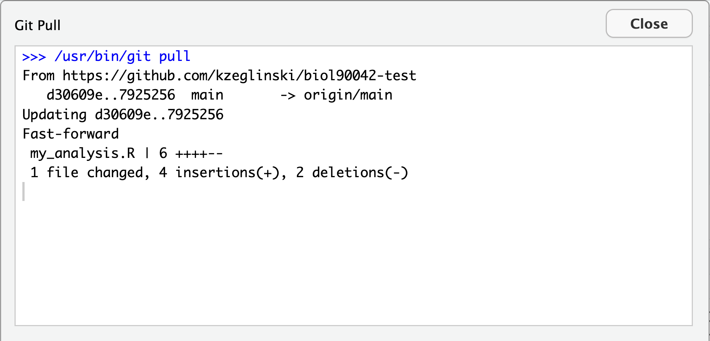{width="806"}

## Collaborating with others

One of the biggest advantages of GitHub is how it lets multiple people work on the same project together. This may be useful for your final project.

### Adding someone to your git repo

The first thing you need to do is give your collaborator(s) access. On your repository's GitHub page, go to '**Settings' \> 'Collaborators'**, then click '**Add people'** and search for your classmate's GitHub username:

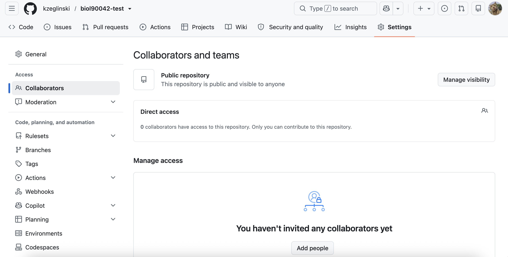{width="1510"}

They'll receive an invitation via email (or a notification on GitHub) which they'll need to accept before they can push changes to your repository. Note that even if your repository is public, anyone can view and clone it, but they'll still need to be added as a collaborator to push changes directly.

### Working on a repo with multiple people

Once you have accepted an invite to someone's repository, you should clone it onto your own computer (following the same steps we used earlier).

Test it out now with a friend!

::: {.callout-important title="Practice exercise: collaborating on an analysis"}
With a partner, try the following:

1.  Both of you should make a small, different change somewhere in the script (for example, one person changes the plot title, while the other adds a new comment) and commit these changes locally

2.  Whoever commits and pushes first will have no trouble. But when the second person tries to push, they should get an error, because the remote history has moved on since they last synced!

3.  To fix this, the second person needs to pull first, to bring down the latest changes from GitHub, before trying to push again

If you were both editing completely different parts of the file, git will usually be able to automatically combine ('merge') both sets of changes for you. But if you happened to edit the exact same lines, you'll encounter a merge conflict, just like we mentioned above! It's usually good practice to agree with your collaborator to work on different parts of the file, and make sure to pull changes often.
:::

Working collaboratively on the same files takes a bit of practice, but a few habits will make your life much easier:

-   **Pull before you start working**, and again before you push, to make sure you have everyone else's latest changes

-   **Commit and push often**, in small chunks, rather than making one giant commit at the end of the day

-   **Communicate with your collaborators** about who is working on what, to minimise the chances of conflicting changes in the first place

With these habits in place, git and GitHub become a really powerful way to collaborate on data analysis projects, whether that's with a couple of classmates or an entire research team!

::: {.callout-note title="Further git resources"}
We've only scratched the surface of git and GitHub today! If you'd like to go further, here are a couple of great resources:

-   [Happy Git with R](https://happygitwithr.com/) is a fantastic, R-specific guide that covers everything we've done today (and more) in much greater depth

-   If you're keen to learn to use git from the command line rather than through RStudio's interface, the [Software Carpentry git novice lesson](https://swcarpentry.github.io/git-novice/) is a great place to start

As with any coding skill, the best way to get comfortable with git is to keep using it, so try to use this for the final project if you can!
:::
